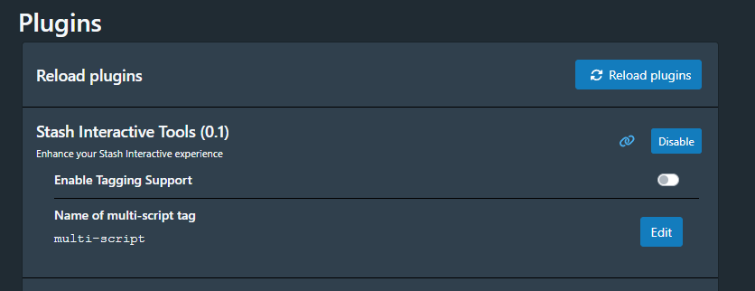
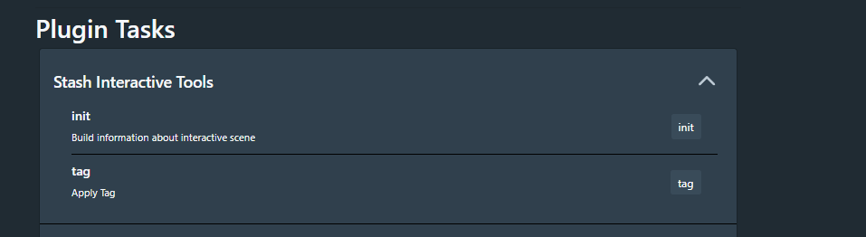
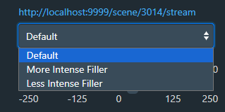

# Stash Interactive Tools
Current features:
- Adds ability to change sync offset
- Adds ability to change the stroke length
- Adds supports for multiple funscripts (with heatmap support)

# Multi Funscripts

The plugin allows to tag all scripts that are found to have multiple tags. To do this go to the plugins
settings and set the tag name you would like to use, the default tag is set to `[SIT: Multi-Script]`

Once set go to the `Tasks` screen and press the `tag` tasks

Currently, the matching logic is very simple, later support will be added to customize.
The logic states:
- Take the base funscript name and use as prefix via an glob lookup
  - ie: `Izzy Green 02 - Puerto Rico Creampie Sextape.funscript`  will look for `Izzy Green 02 - Puerto Rico Creampie Sextape*.funscript`
  - Note: There is special logic added so that versioned files are not picked up..
    - ie: `My Script 01.funscript` and `My Script 02.funscript` each have their own video so when viewing `My Script 01` video it will not return `My Script 02`
- Strip the prefix and remove `()`
  - ie: `Izzy Green 02 - Puerto Rico Creampie Sextape (Less Intense Filler).funscript` and `Izzy Green 02 - Puerto Rico Creampie Sextape (More Intense Filler).funscript`
  Will output  `Less Intense Filler` and  `More Intense Filler` in the ui
  
  

# Requirements
- PythonToolsInstaller plugin
- Python 3.10+
- [Custom Build](https://github.com/stashapp/stash/commit/c8d4dacffd011653b083cfe0e3f0591fb0e3de43) version of stash 
